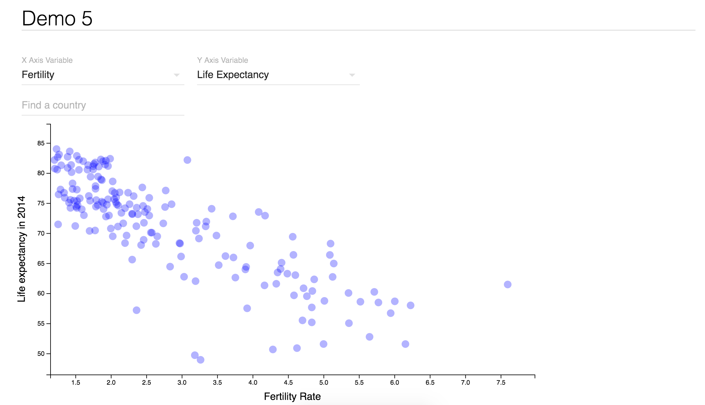

# Testing React+D3 examples
This exercise demonstrates the use of D3 in conjunction with react. Because this project was bootstrapped with [Create React App](https://github.com/facebookincubator/create-react-app), you'll need to run `npm install` inside the project directory to install necessary packages. Then start your server by running `npm start`.

Forked from [Michael Freeman's strata-2016 demo](http://mfviz.com/strata-2016/demo-5/)

The site is live [here](https://reactd3.herokuapp.com/) :

